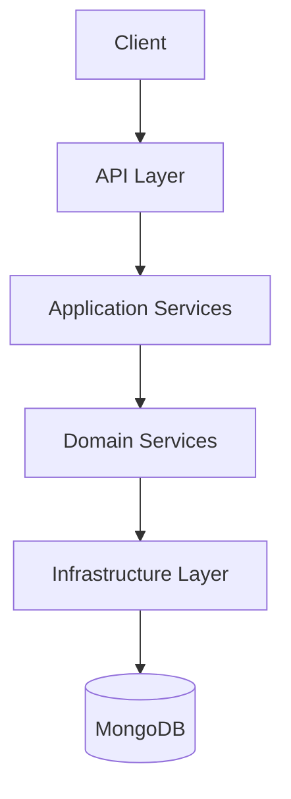

# Banking Application Architecture

## Domain-Driven Design Architecture

This document outlines the architecture for a banking application using Domain-Driven Design (DDD) principles with TypeScript, Node.js, and MongoDB.

## System Overview



## Layered Architecture

### 1. Domain Layer
- Core business logic and rules
- Domain entities (Account, Transaction)
- Domain services
- Value objects
- Domain events

### 2. Application Layer
- Orchestrates the domain objects
- Implements use cases
- Handles application-specific business rules
- Coordinates domain services

### 3. Infrastructure Layer
- Database access (MongoDB with Mongoose)
- External services integration
- Messaging systems
- Logging, caching, etc.

### 4. API Layer
- REST API controllers
- Request/response handling
- Input validation
- Authentication/authorization
- Swagger documentation

## Project Structure

```
/
├── src/
│   ├── domain/
│   │   ├── entities/
│   │   │   ├── account.ts
│   │   │   └── transaction.ts
│   │   ├── valueObjects/
│   │   │   ├── money.ts
│   │   │   └── accountId.ts
│   │   ├── services/
│   │   │   ├── accountService.ts
│   │   │   └── transactionService.ts
│   │   └── events/
│   │       └── transactionCreatedEvent.ts
│   ├── application/
│   │   ├── services/
│   │   │   ├── accountApplicationService.ts
│   │   │   └── transactionApplicationService.ts
│   │   └── dtos/
│   │       ├── accountDto.ts
│   │       └── transactionDto.ts
│   ├── infrastructure/
│   │   ├── database/
│   │   │   ├── connection.ts
│   │   │   └── repositories/
│   │   │       ├── accountRepository.ts
│   │   │       └── transactionRepository.ts
│   │   ├── schemas/
│   │   │   ├── accountSchema.ts
│   │   │   └── transactionSchema.ts
│   │   └── config/
│   │       └── config.ts
│   ├── api/
│   │   ├── controllers/
│   │   │   ├── accountController.ts
│   │   │   └── transactionController.ts
│   │   ├── routes/
│   │   │   ├── accountRoutes.ts
│   │   │   └── transactionRoutes.ts
│   │   ├── middleware/
│   │   │   ├── validation.ts
│   │   │   └── errorHandler.ts
│   │   └── swagger/
│   │       └── swagger.ts
│   └── server.ts
├── tests/
│   ├── unit/
│   │   ├── domain/
│   │   ├── application/
│   │   └── infrastructure/
│   └── integration/
├── docker-compose.yml
├── package.json
├── tsconfig.json
├── jest.config.js
└── README.md
```

## Domain Models

### Account Entity
- Properties:
  - id: string (UUID)
  - name: string
  - balance: Money (value object)
  - createdAt: Date
  - updatedAt: Date

### Transaction Entity
- Properties:
  - id: string (UUID)
  - type: TransactionType (DEPOSIT, WITHDRAWAL, TRANSFER)
  - amount: Money (value object)
  - fromAccountId: string (null for deposits)
  - toAccountId: string (null for withdrawals)
  - description: string
  - status: TransactionStatus (PENDING, COMPLETED, FAILED)
  - createdAt: Date

## API Endpoints

### Account Endpoints
- `GET /api/accounts` - Get all accounts
- `GET /api/accounts/:id` - Get account by ID
- `POST /api/accounts` - Create new account
- `GET /api/accounts/:id/transactions` - Get transactions for account

### Transaction Endpoints
- `POST /api/transactions/deposit` - Deposit money to account
- `POST /api/transactions/withdraw` - Withdraw money from account
- `POST /api/transactions/transfer` - Transfer money between accounts

## Database Design

### Account Collection
```json
{
  "_id": "ObjectId",
  "name": "String",
  "balance": "Number",
  "createdAt": "Date",
  "updatedAt": "Date"
}
```

### Transaction Collection
```json
{
  "_id": "ObjectId",
  "type": "String",
  "amount": "Number",
  "fromAccountId": "ObjectId or null",
  "toAccountId": "ObjectId or null",
  "description": "String",
  "status": "String",
  "createdAt": "Date"
}
```

## Testing Strategy

- Unit tests for domain logic
- Integration tests for repositories and services
- API endpoint tests
- Test coverage target: 80%+